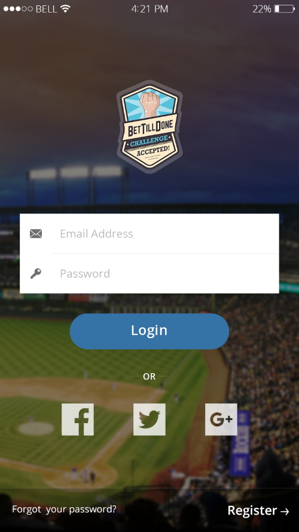

## The project

BetTillDone is a modern social betting platform, that allows users to create individual bets and compete against each other for fun. Users may also create their own betting games and invite their friends to take part.

Furthermore, it features public competitions for big events like football World Cup or European Championship and the like regularly, where all users can take part and win prizes.

The application includes a web app as well as native apps for Android and iOS.

## When?

05/2016 - 11/2016

## My role

### CTO

We started this project as a kind of playground to test technologies when a new member, Jürgen, joined the TillDone team.

Our ambitious plan was to launch before the start of the UEFA Euro 2016 in June - and with a great team effort we managed to achieve it.

I was responsible for the **Ionic** part of the project and for guiding our new team member.

## Key technologies

* Ionic
* WordPress

The project consists of a main info page realized in WordPress with a connected login part implemented as an Ionic PWA.

The Ionic part was also launched as a stand-alone app for Android and iOS.

## Impressions

## Link

<a target="_blank" href="https://www.bettilldone.com">bettilldone.com</a>