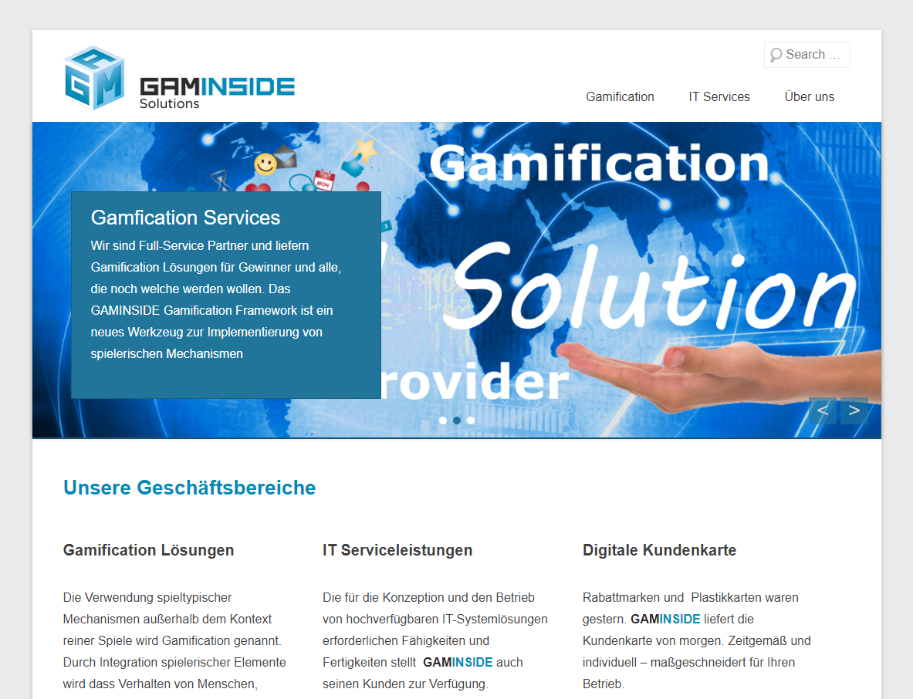

## The project

The GAMInside core product is a gamification engine that can be used as a whitelabel solution to introduce the principles of gamification to any existing (online) business.

The applications it is used for range from major MMORPGs to Facebook apps and beyond.

## When?

09/2011-06/2015

## My role

### Software Developer, Lead Software Engineer & Technical Consultant

I joined the GAMInside team right after finishing university when it was still an early stage startup.

Over the years the team grew and I evolved into the role of Lead Software Engineer.

After leaving GAMInside to start my own self-employed business, I continued to provide technical consultancy.

## Key technologies

* Java
* PHP

## Impressions

## Link

[www.gaminside.com](https://www.gaminside.com)