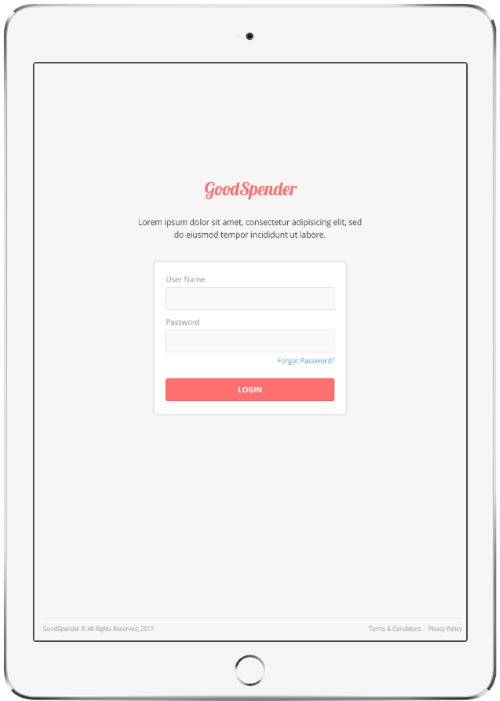
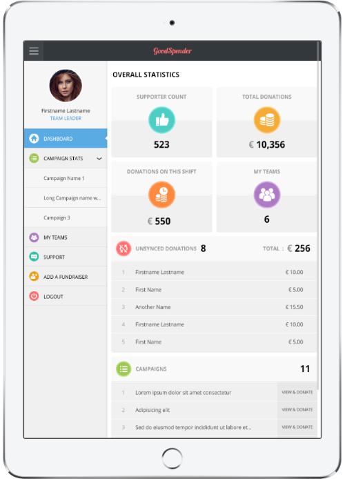
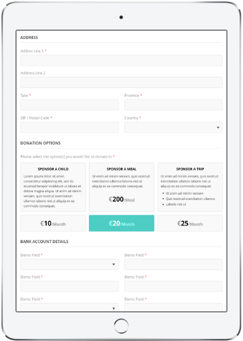

## The project

GoodSpender is an app used for collecting donations on tablets and mobile phones we developed for a major Face2Face fundraising company.

The application includes a Progressive Web App (PWA) as well as a sophisticated form creator that allows users to create highly individual forms according to the needs of a specific fund raising campaign.

## When?

2017-2019

## My role

### CTO

## Key technologies

* Angular
* nodeJS

## Impressions

## Link

This project is intended for use by the employees of the client only, so there is no public link.