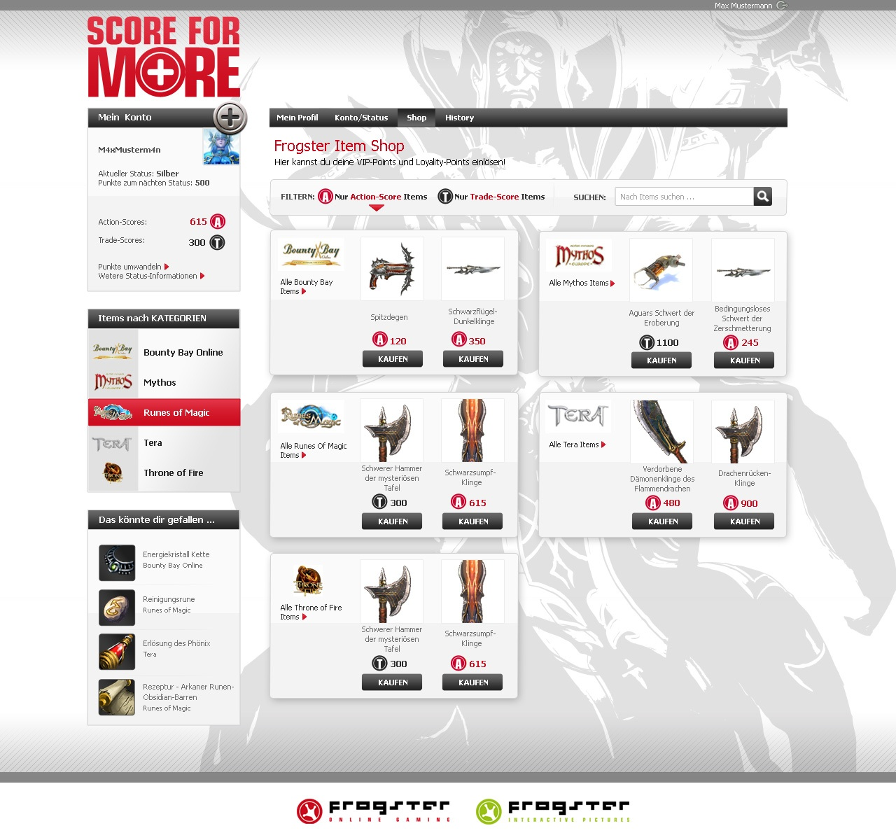
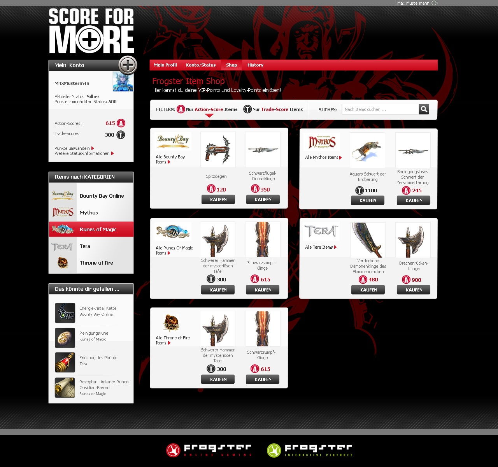
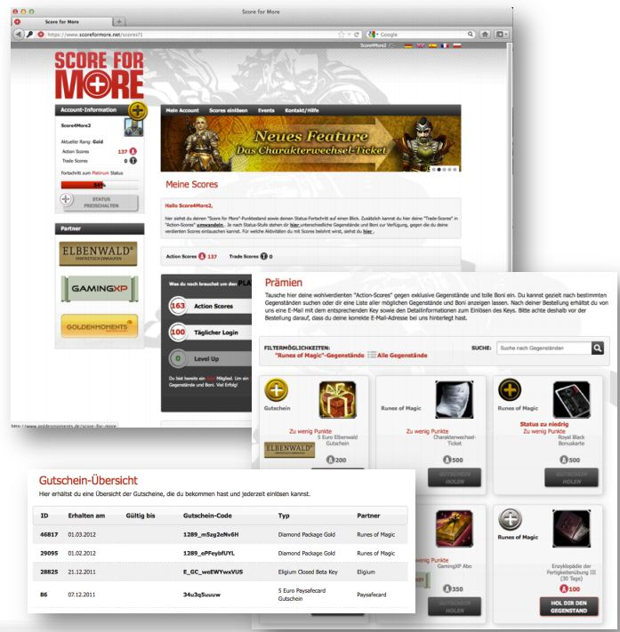

## The project

ScoreForMore was a gamification platform based on the GAMInside gamification engine for the MMORPG Runes of Magic by Gameforge. Via ScoreForMore, users of the game were rewarded for their usual activities in the game with unique ingame items and other rewards.

## When?

2011-2013

## My role

### Software Developer

## Key technologies

* Java

## Impressions

## Link

This project has been discontinued.