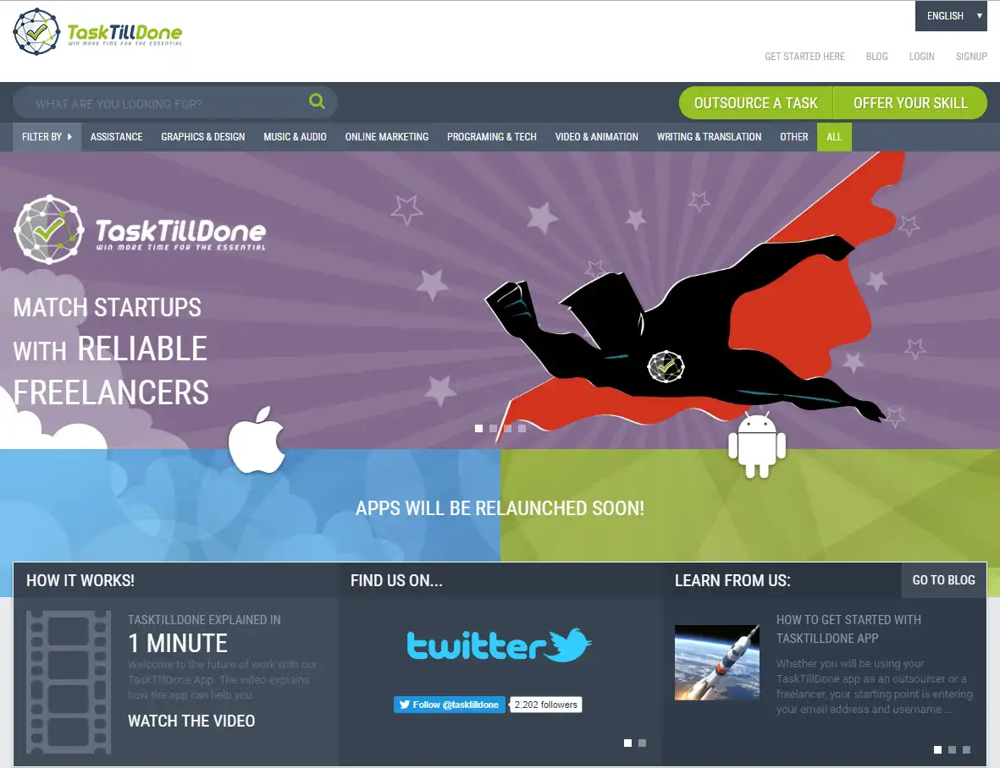

## The project

TaskTillDone is an outsourcing platform that connects businesses with professional freelancers and agencies. It offers a marketplace where users can apply for outsourced tasks. Freelancers may also create a profile and offer their individual skills on the marketplace.

The platform includes a web app as well as native apps for both Android and iOS.

## When?

Since 01/2015

## My role

My good friend Leo Brunnhofer started this project in 2014. After becoming self-employed in 2015, I joined him as <strong>Lead Software Developer</strong> and we developed the platform together. We launched the website as well as mobile apps for both Android and iOS in 2015 and run the project since then.

## Key technologies

* AngularJS
* Ionic

## Impressions

## Link

[www.tasktilldone.com](https://www.tasktilldone.com)