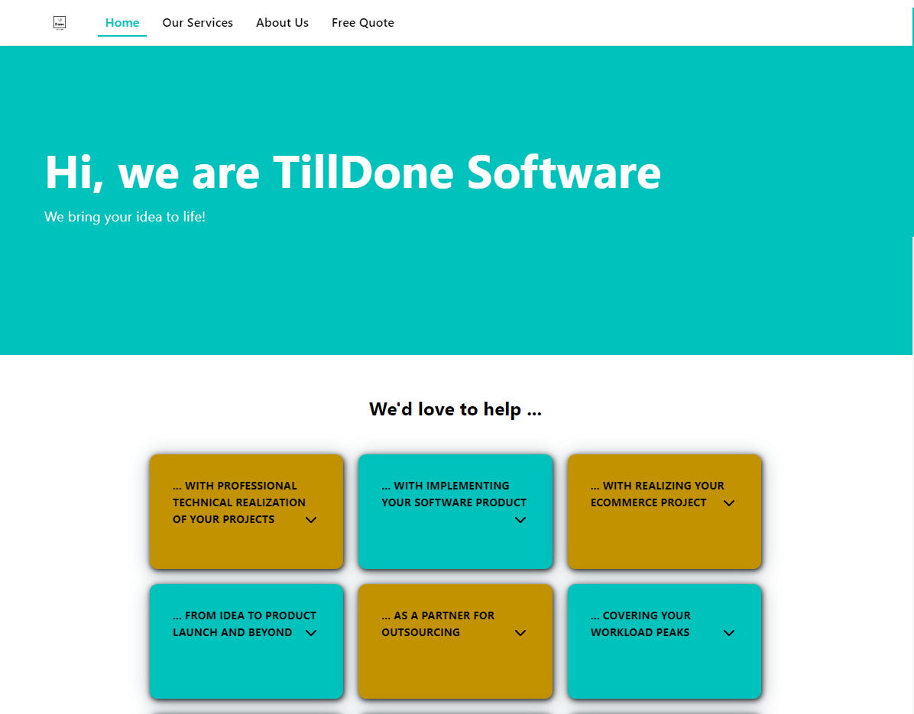

## The project

TillDone Software is the web presence of my collaboration with my long-term partner Leo Brunnhofer and other experienced experts.

## When?

Since 10/2015

## My role

### CTO

I was responsible for choosing the technology for the website as well as implementing most parts of it.

I went for GatsbyJS over classic CMS systems, mainly to try a new technology and to get a high performance lightweight solution.

## Key technologies

* GatsbyJS

## Impressions

## Link

[www.tilldone.software](https://www.tilldone.software)