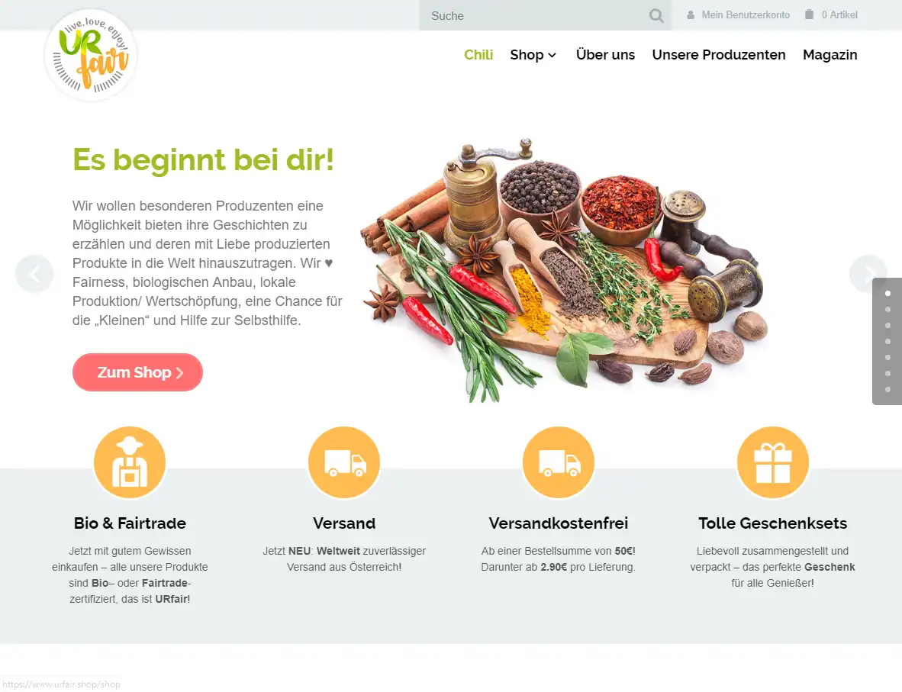
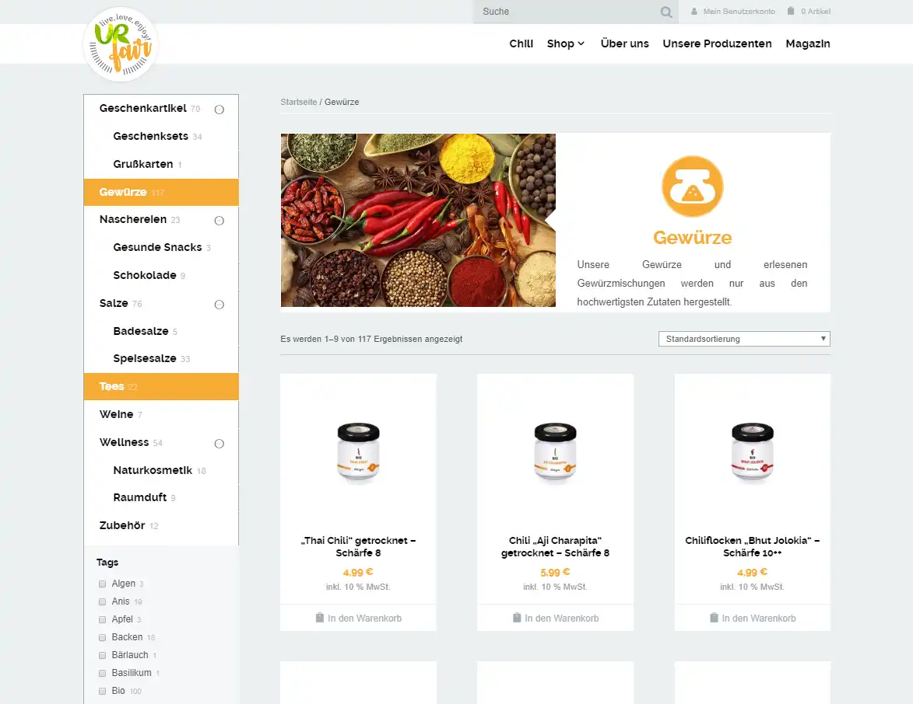
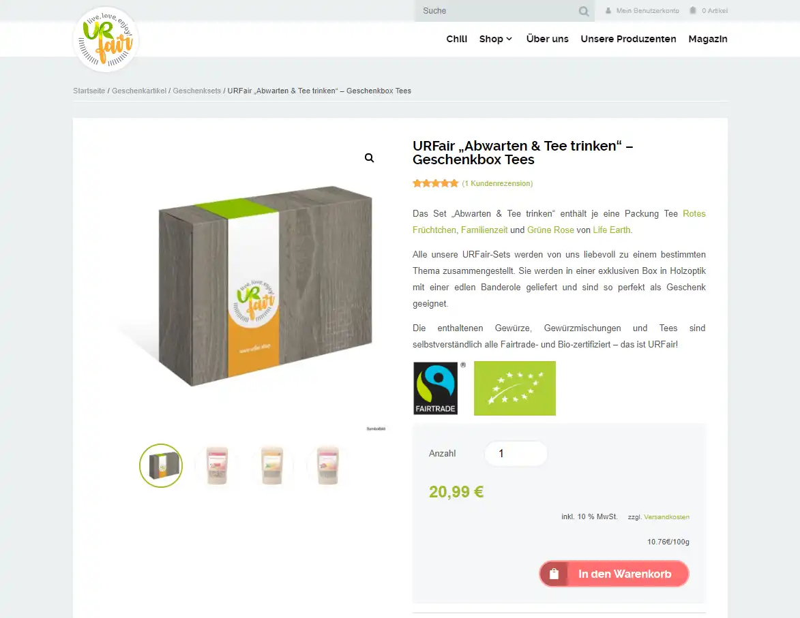

## The project

URfair is an e-commerce shop for special products from producers with a great story, produced organically and following Fair Trade principles. The range includes spices, teas, wine, cosmetics and many other categories.

## When?

Since 10/2017

## My role

### CTO

I am responsible for all decisions regarding technology, for feature development, but also for shop management and content creation.

## Key technologies

* WordPress
* WooCommerce
* PHP

## Impressions

## Link

[www.urfair.shop](https://www.urfair.shop)